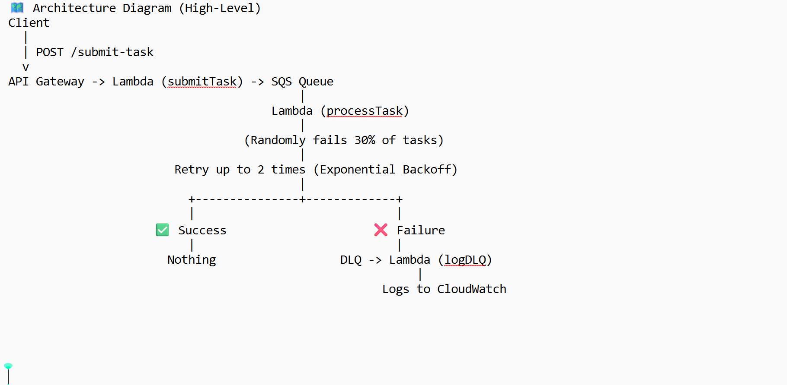

# 🏗️ System Architecture

## Components
- **API Gateway**: Receives incoming HTTP requests.
- **Lambda Functions**:
  - `submit`: Sends tasks to SQS.
  - `process`: Processes tasks from SQS.
  - `handlerDLQ`: Handles failed messages.
- **SQS Queues**:
  - `TestQueue`: Main task queue.
  - `DeadLQueue`: Dead-letter queue for failed tasks.
- **DynamoDB**: Stores task data.
